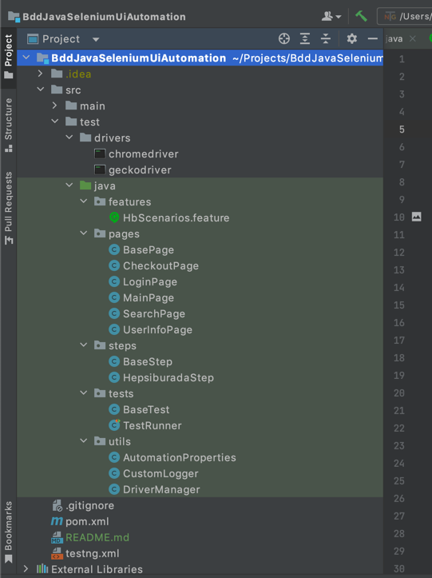
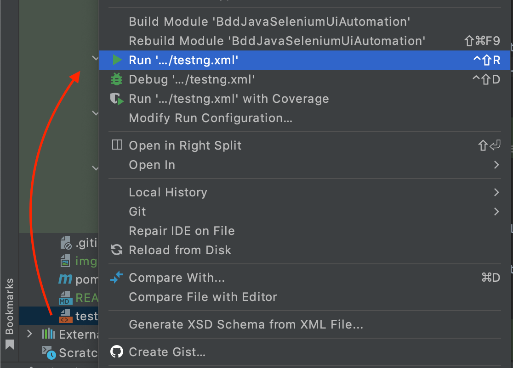
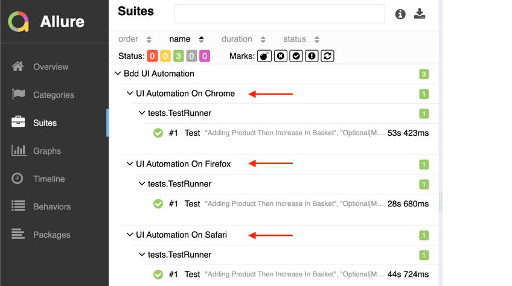
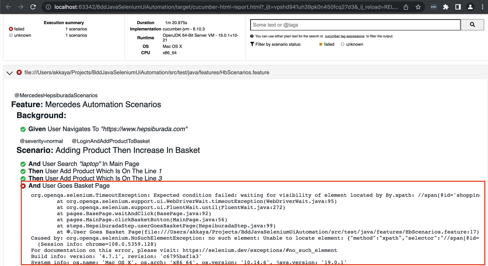
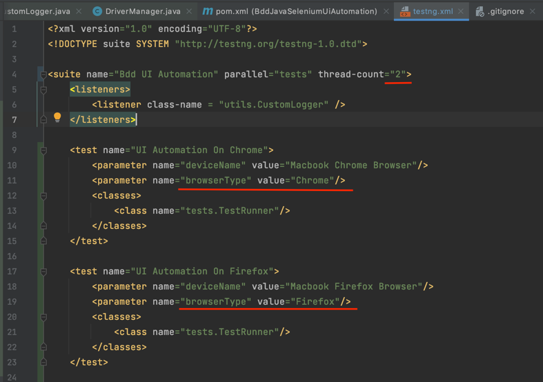
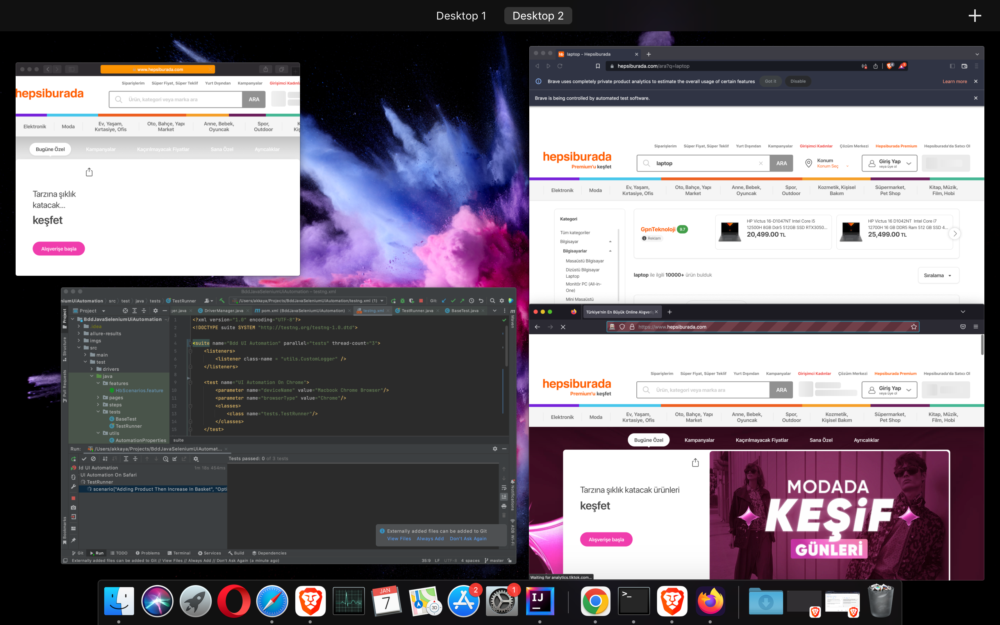

# Parallel Cross Browser Bdd Ui Test Automation Framework
Java Selenium Automation Test With Gherkin Syntax

# Test Approach
The tests were created for ui automation testing, on every test run some checks and validation are done with certain and random inputs to verify that data is displayed, clicked and edited correctly.


# Project Solution


Features folder contains our tests. Encoded with the Gherkin syntax. Background steps work before the test and ensure that the test becomes executable.

Utils directory allows the driver to be created and passed other classes.

CustomLogger class created for extended logging. It can be detailed later depends on our requirement.

Tests directory is contains TestRunner and BaseTest. TestNG.xml runs test runner.

The steps directory contains the descriptions of the steps written in the features files.
BaseSteps class is used for create PageObject and pass driver to these classes.

The PageObject directory contains the objects in the pages and the methods that will operate on these objects.

Testng.xml file contains parallelize option with browser parameter to run our tests.

Drivers directory contains browser drivers.

This type of solution was used for better code reliability, maintainability of ui automation testing framework.


# Framework / Libraries / Tech Stack

        Jdk 1.8
        Selenium-java 3.141
        Testng 7.4.0
        Allure-Report 2.20.0
        Cucumber-java 6.10
        Surfire-Report


This project was developed using Java V1.8 with TestNg, Maven, Cucumber as a ui test automation framework.


# Scenarios covered on the solution

**The following scenarios are cover by the automation test suite:**

**@severity=normal**
**@LoginAndAddProductToBasket**
* **Scenario: Adding Product Then Increase In Basket**

**@severity=normal**
**@UpdateUserBirthday**
* **Scenario: Update User Birthday**


# Framework Installation & Prerequisites

* This project was set up on macOS Majove 10.14.6.You should update drivers
for your own operating system.


* For Windows: chromedriver.exe

## Prerequities

```bash
#Maven binaries should be previously downloaded.
$ tar -xvf apache-maven-3.6.3-bin.tar.gz

$ export M2_HOME="/Users/{yourUser}/Downloads/apache-maven-3.6.3"
$ PATH="${M2_HOME}/bin:${PATH}"
$ export PATH
$ mvn -version     

OpenJDK 64-Bit Server VM warning: Ignoring option MaxPermSize; support was removed in 8.0
Apache Maven 3.6.3 (cecedd343002696d0abb50b32b541b8a6ba2883f)
Maven home: /Users/{yourUser}/Downloads/apache-maven-3.6.3
```

```bash
Browser Drivers(chromedriver,geckodriver) should be installed.
Dmg package can be downloadable from own site.

```

```bash
#npm also should be installed for allure installation on your macOS 10.14 Majove
$ npm install -g allure-commandline --save-dev

# 'Allure serve' command can be usable directly

```

## Installation

```bash
Open project with IntellijIdea (Optional).

'Open terminal to install repositories in pom.xml via mvn'

$ mvn dependency:resolve

or

'Maven plugin in your ide can resolve dependencies automatically'
```

## Usage
Download mvn packages. 

İt is possible to start test via testng.xml



For running and generating report, mvn command directly help us to do.
After mvn test command : **Cucumber Report** And **Surefire Report** Automatically Created In **Target** Folder. 

```java

$ mvn clean test //directly run test succesfully

```

In Order To Generate Allure Report:
After test run, allure plugin generates azure files.
Then we have to serve this report with given command

```java

$ allure serve

```
### Sample Report

#### Allure Report
Allure Report reports to us whether the parallel tests passed in which browser and machine.


#### Cucumber Report
The Cucumber report shows us directly where the error occurred in the running test.



## Parallel & Cross Browser Run




The **testng.xml** file will help us to run the tests in parallel.

The **thread-count** parameter should be specified for the number of browsers that will run in parallel.

The **browserType** parameter allows us to select the browser type (chrome, firefox, opera, safari...).

### Sample Run
3 Cross Browser Parallel
(Safari, Chrome, Firefox)

